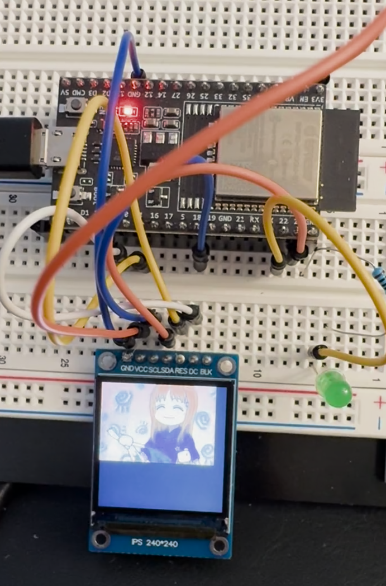
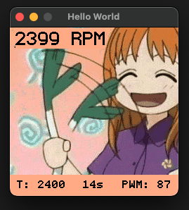

# ESP fan control

ESP32 based fan control with a silly GUI, using embedded-graphics

Initially generated from [the esp-rs/esp-idf template](https://github.com/esp-rs/esp-idf-template) ([documented here](https://docs.esp-rs.org/book/writing-your-own-application/generate-project/esp-idf-template.html)).



## Get up and running

1. direnv allow
2. cargo install espup 
3. espup install
4. cargo run

Cargo run will build the project for xtensa and flash it to the ESP32.

## Recipes

### GUI



You can simulate the GUI on your host machine (makes development iteration faster)
by running:

```sh
./simulate-gui.sh
```

or, to restart on code changes:

```sh
./simulate-gui.sh --watch
```

### Misc

- `espflash board-info` - Get information about the connected board
